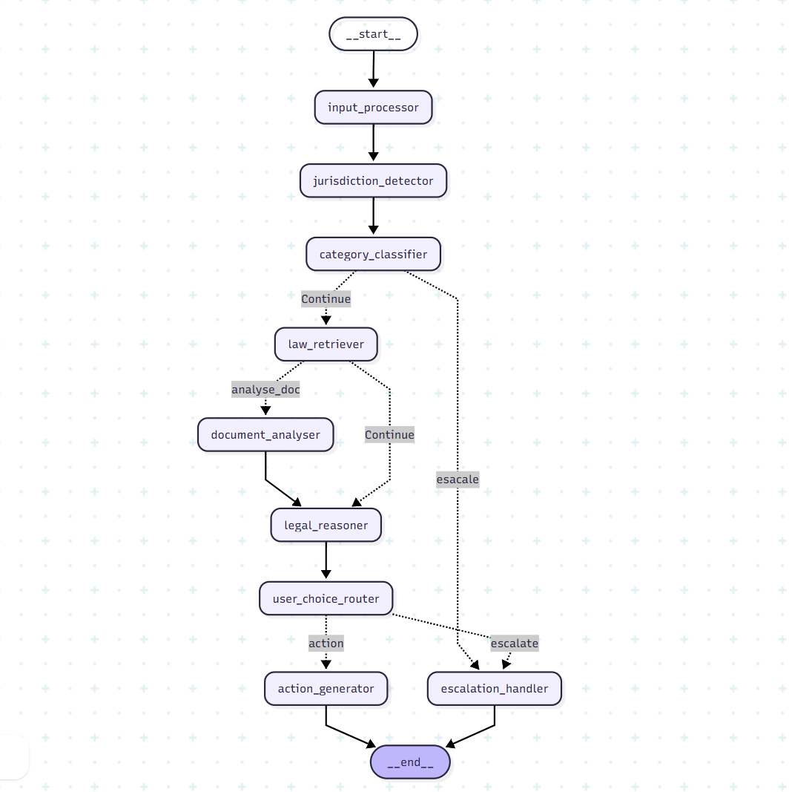

# ⚖️ Indian Legal First-Aid Agent

> A RAG-powered legal assistant that helps Indian citizens understand their rights, analyse agreements, and generate ready-to-send legal notices — or safely escalate to a licensed advocate.


[](https://legal-ai-agent-hsim.streamlit.app)
[](https://github.com/harsimar-singh03/legal-ai-agent)
[](https://www.python.org/)

---

## What It Does

Most Indian citizens don't know their legal rights. Laws are complex, state-specific, and spread across hundreds of Bare Acts. This agent bridges that gap:

- Accepts **plain-language problems** in English or Hinglish
- Auto-detects **jurisdiction** (state) and **legal category** (tenancy, consumer, cyber, etc.)
- Retrieves the **exact Bare Act sections** that apply via vector search (Qdrant)
- Supplements with **live web search** for recent Supreme Court judgments (Tavily)
- Produces a **citation-grounded reasoning chain** — every claim cites a real section
- Analyses **uploaded PDF agreements** clause-by-clause against the law
- Generates a **ready-to-send legal notice or complaint letter** (PDF download)
- **Escalates safely** to licensed advocates when confidence is low, with NALSA helplines and DLSA directory

---

## Architecture

A **9-node LangGraph state machine** with human-in-the-loop interrupts and conditional routing.




### Node Walkthrough

| # | Node | What It Does |
|---|------|--------------|
| 1 | **Input Processor** | Extracts text from uploaded PDFs via PyMuPDF |
| 2 | **Jurisdiction Detector** | LLM infers country/state; interrupts user if missing |
| 3 | **Category Classifier** | Classifies legal domain; routes out-of-scope cases directly to escalation |
| 4 | **Law Retriever** | Qdrant vector search (filtered by jurisdiction + category) + Tavily web search |
| 5 | **Document Analyser** | Clause-by-clause risk analysis against retrieved law *(only if PDF uploaded)* |
| 6 | **Legal Reasoner** | Citation-grounded reasoning — every claim must cite a retrieved section |
| 7 | **Confidence Evaluator** | Computes retrieval quality label (high / medium / low) for transparency |
| 8 | **User Choice Router** | User picks: "Generate a document" or "Help me find a lawyer" |
| 9a | **Action Generator** | Produces a fully personalised legal notice or complaint letter |
| 9b | **Escalation Handler** | Safe hand-off with NALSA helplines, DLSA directory, and document checklist |

---

## Tech Stack

| Layer | Technology |
|-------|-----------|
| **Orchestration** | LangGraph (StateGraph, interrupt/resume, SqliteSaver checkpointing) |
| **LLM** | Groq `GPT-OSS 120B` (fast inference, JSON mode) |
| **Embeddings** | `all-MiniLM-L6-v2` — 384-dim, local via sentence-transformers |
| **Vector DB** | Qdrant Cloud (cosine similarity, metadata-filtered search) |
| **Web Search** | Tavily API |
| **Frontend** | Streamlit (chat UI, PDF upload, document download) |
| **Observability** | LangSmith (full graph tracing + LLM call inspection) |
| **Persistence** | SQLite via SqliteSaver |

---

## Project Structure

```
legal-ai-agent/
├── app.py                        # Streamlit UI
├── requirements.txt
├── .env.example                  # API key template
├── langgraph.json                # LangGraph Studio config
├── src/
│   ├── state.py                  # AgentState (Pydantic model)
│   ├── models.py                 # Structured LLM output models
│   ├── graph.py                  # LangGraph state machine
│   └── nodes/
│       ├── input_processor.py
│       ├── jurisdiction_detector.py
│       ├── category_classifier.py
│       ├── law_retriever.py
│       ├── document_analyser.py
│       ├── legal_reasoner.py
│       ├── confidence_evaluator.py
│       ├── user_choice_router.py
│       ├── action_generator.py
│       └── escalation_handler.py
└── data/
    └── chunks.jsonl              # Pre-processed legal chunks (~2,300 sections)
```

---

## Quick Start

**Prerequisites:** Python 3.10+, and free-tier API keys for Groq, Qdrant Cloud, and Tavily.

```bash
git clone https://github.com/harsimar-singh03/legal-ai-agent.git
cd legal-ai-agent

python -m venv venv
source venv/bin/activate        # Windows: venv\Scripts\activate

pip install -r requirements.txt
cp .env.example .env            # Add your API keys here

streamlit run app.py
```

Open `http://localhost:8501` and try a query like:

> *"I bought a phone in Mumbai for ₹25,000. It stopped working after 3 days. The shop refuses to refund."*

**[Or try the live demo →](https://legal-ai-agent-hsim.streamlit.app)**

---

## Key Design Decisions

**Section-aware chunking** — Each Bare Act section is stored as a single chunk with metadata (`act_name`, `jurisdiction`, `category`). Legal meaning breaks if you cut mid-provision.

**Metadata-filtered retrieval** — Qdrant filters by detected state AND `"India"`, ensuring central acts (Consumer Protection, IT Act) are always included for state-specific queries.

**Human-in-the-loop at the right moments** — The agent pauses to ask for missing jurisdiction or document details rather than guessing, which would corrupt downstream retrieval.

**User-controlled outcomes** — After showing the reasoning, the agent asks the user what they want. It never silently decides whether to generate a document or refer to a lawyer.

**Hard escalation boundaries** — Criminal law, family law, and multi-state disputes are routed directly to the escalation handler via the `"other"` category. The agent never guesses outside its defined scope.

---

## Connect

- **LinkedIn:** https://www.linkedin.com/in/harsimar-singh-527155326/
- **Email:** harsimar28singh@gmail.com
---

*Built for India's everyday legal needs. This is a first-aid tool, not a substitute for professional legal advice.*
