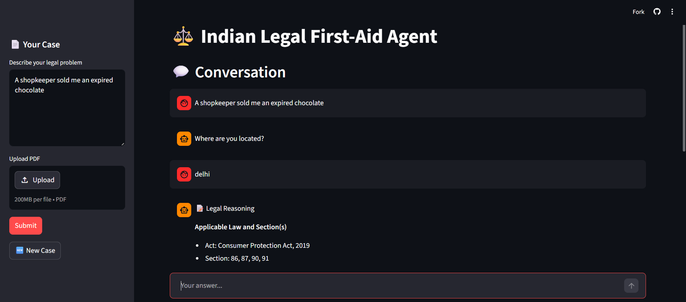
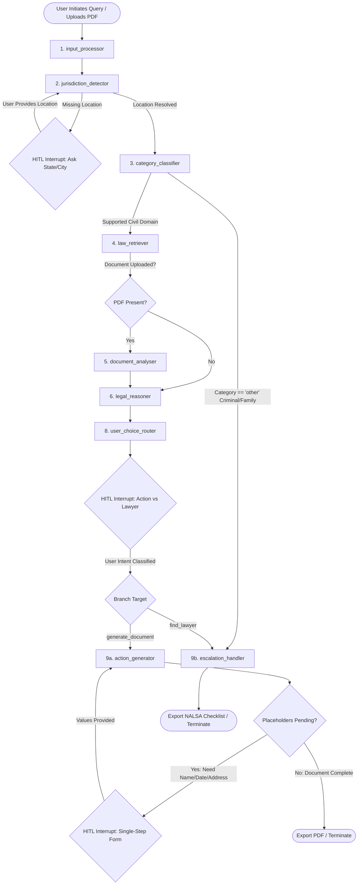
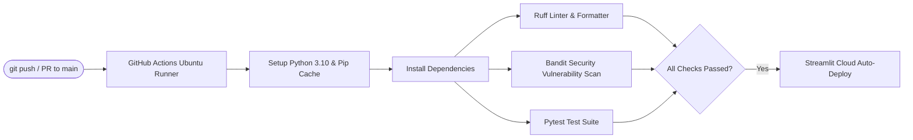

# ⚖️ Indian Legal First-Aid Agent

> **An enterprise-grade, RAG-powered agentic legal assistant designed to demystify Indian statutory law, audit agreement contracts, and autonomously draft formal legal notices — with deterministic safety escalation to licensed advocates.**

[](https://legal-ai-agent-hsim.streamlit.app)
[](https://github.com/harsimar-singh03/legal-ai-agent)
[](https://www.python.org/)
[](https://github.com/langchain-ai/langgraph)
[](https://qdrant.tech/)
[](https://groq.com/)
[](https://github.com/harsimar-singh03/legal-ai-agent/actions)



---

## 📑 Table of Contents
1. [Executive Summary & Problem Statement](#-executive-summary--problem-statement)
2. [End-to-End System Architecture](#-end-to-end-system-architecture)
   - [LangGraph State Machine](#langgraph-state-machine)
   - [Node-by-Node Execution Mechanics](#node-by-node-execution-mechanics)
   - [Agent State Schema](#agent-state-schema)
3. [Deep-Dive: Core Engineering Decisions & Trade-Offs](#-deep-dive-core-engineering-decisions--trade-offs)
   - [1. Section-Aware Regex Chunking vs. Fixed-Window Splitters](#1-section-aware-regex-chunking-vs-fixed-window-splitters)
   - [2. Multi-Tiered Metadata-Filtered Vector Retrieval](#2-multi-tiered-metadata-filtered-vector-retrieval)
   - [3. Eliminating State-Reset Loops in Human-in-the-Loop Interrupts](#3-eliminating-state-reset-loops-in-human-in-the-loop-interrupts)
   - [4. Groq LPU Inference & Reasoning Format Tuning](#4-groq-lpu-inference--reasoning-format-tuning)
   - [5. Multilingual Ingestion with Formal Legal Output](#5-multilingual-ingestion-with-formal-legal-output)
   - [6. Deterministic Safety Boundaries & Ethical Gating](#6-deterministic-safety-boundaries--ethical-gating)
4. [Empirical Benchmarks & System Metrics](#-empirical-benchmarks--system-metrics)
5. [Data Pipeline & Vector Database Schema](#-data-pipeline--vector-database-schema)
   - [Ingested Bare Acts](#ingested-bare-acts)
   - [Qdrant Collection Architecture](#qdrant-collection-architecture)
   - [SQLite Checkpoint Persistence](#sqlite-checkpoint-persistence)
6. [Repository Structure](#-repository-structure)
7. [Installation & Local Reproduction Guide](#-installation--local-reproduction-guide)
   - [Prerequisites & Environment Setup](#prerequisites--environment-setup)
   - [Building the Vector Index](#building-the-vector-index)
   - [Running the Streamlit Application](#running-the-streamlit-application)
   - [Running the Local Latency Benchmark](#running-the-local-latency-benchmark)
8. [Continuous Integration & Code Quality (CI/CD)](#-continuous-integration--code-quality-cicd)
9. [Step-by-Step Case Study Walkthrough](#-step-by-step-case-study-walkthrough)
10. [Disclaimers & Limitations](#-disclaimers--limitations)
11. [Author & Contact](#-author--contact)

---

## 🏛️ Executive Summary & Problem Statement

India’s judicial system faces an unprecedented backlog exceeding **50 million pending cases** across district courts, High Courts, and the Supreme Court. For the average Indian citizen, navigating everyday civil grievances—such as an unreturned rental deposit, an unfulfilled consumer refund, or delayed salary payments—presents severe structural hurdles:

1. **Information Asymmetry & Language Barriers:** Central Bare Acts and state amendments are drafted in dense legal English, while citizens naturally formulate grievances in colloquial Hindi or Hinglish.
2. **Federal vs. State Jurisdiction Fragmentation:** Landlord-tenant laws differ drastically between states (e.g., the *Delhi Rent Control Act, 1958* vs. the *Maharashtra Rent Control Act, 1999*), while overarching consumer or IT issues fall under federal jurisdiction. Generic LLMs routinely hallucinate interstate legal overlaps.
3. **Prohibitive Early-Stage Legal Costs:** Drafting a simple legal demand notice often incurs advocate fees ranging from ₹3,000 to ₹15,000, deterring low-to-medium-value dispute resolution.
4. **Unauthorized Practice of Law (UPL) Risks:** Autonomous AI chatbots that fabricate non-existent statute citations or advise on criminal/matrimonial matters create catastrophic liability.

### The "Legal First-Aid" Paradigm
This platform does not replace an advocate; it operates as an **algorithmic triage unit**. The system parses plain-language descriptions, auto-classifies the legal domain, resolves territorial jurisdiction, retrieves exact statutory provisions via vector search, audits contract agreements clause-by-clause, and generates ready-to-send formal legal notices in English—all while deterministically routing criminal, family, and high-stakes disputes directly to official **NALSA (National Legal Services Authority)** and **DLSA** legal aid clinics.

---

## 📐 End-to-End System Architecture

The core of the system is built as an asynchronous, stateful **9-node LangGraph State Machine** backed by SQLite checkpoint persistence and human-in-the-loop (HITL) interrupt capability.



### LangGraph State Machine

The entire execution state is governed by a unified Pydantic model (`AgentState`). At every node transition, LangGraph serializes the state to an on-disk SQLite checkpointer (`SqliteSaver`), enabling full graph pause, crash recovery, and conversational resumption across web server reboots.

### Node-by-Node Execution Mechanics

| Node | Name | Technical Responsibility | Primary Mechanism / Models |
|---|---|---|---|
| **1** | **`input_processor`** | Ingests uploaded PDF contracts/agreements and extracts sanitised text blocks. | `PyMuPDF` (`fitz`), memory buffer stream. |
| **2** | **`jurisdiction_detector`** | Deduces territorial state and national jurisdiction from the user narrative. | `openai/gpt-oss-120b` (JSON Mode, temperature 0.0). Pauses with `interrupt()` if location is omitted. |
| **3** | **`category_classifier`** | Classifies grievance into 6 civil categories (`consumer`, `employment`, `tenancy`, `cyber`, `RTI`, `workplace_harassment`) or `"other"`. | Zero-shot JSON classification with strict out-of-scope boundaries. Routes `"other"` directly to escalation. |
| **4** | **`law_retriever`** | Executes multi-stage hybrid retrieval: metadata-filtered vector search over Bare Acts + real-time case law web search. | `all-MiniLM-L6-v2` embeddings, `QdrantClient` (`MatchAny` filter), and `TavilyClient` API. |
| **5** | **`document_analyser`** | Audits uploaded contract agreements clause-by-clause against retrieved statutory benchmarks to flag unfair terms. | Paragraph clause parsing, LLM risk taxonomy (`low`, `medium`, `high`) referencing specific statutory conflicts. |
| **6** | **`legal_reasoner`** | Synthesizes facts, retrieved statutes, and case law into a strict 5-part legal reasoning chain. Constrained to 500–600 words. | `openai/gpt-oss-120b` with `max_tokens=4096` and strict citation grounding (no ungrounded assertions allowed). |
| **7** | **`confidence_evaluator`** | Evaluates retrieval vector scores and reasoning certainty (high / medium / low). | Statistical cosine score mean ($\ge 0.6$ high, $\ge 0.4$ medium, $< 0.4$ low) + sentiment hedge detection. |
| **8** | **`user_choice_router`** | Puts control in the user's hands: allows the citizen to choose between legal document generation or lawyer referral. | Natural language intent classification resolving to `"generate_document"` or `"find_lawyer"`. |
| **9a** | **`action_generator`** | Drafts customized, legally enforceable formal notices or complaint letters in English, resolving template placeholders. | Decoupled single-pass generation + bracket regex extraction (`\[(.*?)\]`) + sequential form filling. |
| **9b** | **`escalation_handler`** | Handles out-of-scope, criminal, or complex matters with zero hallucination risk. | Deterministic assembly of NALSA helpline (15100), Tele-Law (14454), DLSA directory links, and personalized case checklists. |

### Agent State Schema

Defined in [`src/state.py`](file:///d:/ai_project/legal-ai/src/state.py), the `AgentState` manages the end-to-end data lifecycle:

```python
class AgentState(BaseModel):
    # Conversational Memory
    messages: list = []  # Chronological list of {"role": str, "content": str}

    # User Input Buffers
    user_query: str = ""
    document_path: Optional[str] = None
    document_text: Optional[str] = None

    # Analytical Inferences
    jurisdiction: Optional[Dict[str, str]] = None  # e.g., {"country": "India", "state": "Karnataka"}
    category: Optional[List[str]] = None          # e.g., ["tenancy"]
    needs_clarification: bool = False
    clarification_question: Optional[str] = None

    # Retrieval Context
    retrieved_chunks: Optional[List[Dict[str, Any]]] = None  # Vector chunks with section metadata
    web_search_results: Optional[str] = None                 # Tavily Supreme Court precedents

    # Document Risk Audit
    clause_analysis: Optional[List[Dict[str, Any]]] = None   # Clause text, risk level, explanation

    # Grounded Reasoning
    reasoning_chain: Optional[str] = None
    confidence_score: Optional[str] = None

    # Output Artifacts
    action_output: Optional[str] = None  # Drafted notice or NALSA escalation text
    escalation_needed: bool = False
    user_choice: Optional[str] = None    # "generate_document" | "find_lawyer"
```

---

## 🔬 Deep-Dive: Core Engineering Decisions & Trade-Offs

### 1. Section-Aware Regex Chunking vs. Fixed-Window Splitters

#### The Challenge
Standard RAG tutorials employ naive chunking splitters like LangChain's `RecursiveCharacterTextSplitter(chunk_size=500, chunk_overlap=50)`. In legal text, this approach is destructive. Statutory provisions contain operative clauses, provisos, and exceptions. If a character limit cuts mid-sentence between a general right and its critical statutory exception, the vector embedding becomes semantically corrupted, leading to severe legal hallucinations.

#### The Implementation
In [`scripts/chunker.py`](file:///d:/ai_project/legal-ai/scripts/chunker.py), we engineered a deterministic regex boundary parser:

```python
# Matches section headings like "Section 35. ", "35. ", or "Section 12 - "
pattern = r'(?:Section\s+)?(\d+)[\.\s\-]+'
parts = re.split(pattern, text)
```

By enclosing `(\d+)` in capturing parentheses, Python's `re.split()` retains the section numbers in the output array. The chunker reassembles each section into a standalone, self-contained record:

```
[Raw Act PDF] ──> [PyMuPDF Page Cleaning] ──> [Regex Section Split] ──> [JSONL Record]
                                                                        ├── act_name
                                                                        ├── section_number
                                                                        ├── jurisdiction
                                                                        ├── category
                                                                        └── text (Full Section)
```

#### The Engineering Trade-off
* **Trade-off:** Chunk sizes vary depending on the length of the statute (from 50 words up to 800 words), leading to variable embedding density.
* **Why it's superior:** Every chunk indexed in Qdrant represents **one complete, legally coherent statutory provision**. The embedding vector maps strictly to the legal concept defined by Parliament or state legislatures.

---

### 2. Multi-Tiered Metadata-Filtered Vector Retrieval

#### The Challenge
India possesses a federalized legal structure:
* **Central Statutes** (e.g., *Consumer Protection Act, 2019*, *IT Act, 2000*) apply universally across the entire territory of India.
* **State Statutes** (e.g., *Maharashtra Rent Control Act, 1999*, *Delhi Rent Control Act, 1958*) apply **strictly within their state borders**.

A naive vector search on a tenancy dispute in Mumbai would retrieve provisions from Delhi's rent control acts based purely on semantic similarity, giving illegal advice.

#### The Implementation
In [`src/nodes/law_retriever.py`](file:///d:/ai_project/legal-ai/src/nodes/law_retriever.py), we construct compound boolean filters using Qdrant's `MatchAny` condition:

```python
must_conditions = []

# Territorial filter: match specific State OR Central Union jurisdiction
if state.jurisdiction and state.jurisdiction.get("state"):
    must_conditions.append(
        FieldCondition(
            key="jurisdiction",
            match=MatchAny(any=[state.jurisdiction["state"], "India"])
        )
    )

# Domain filter: match categorized legal area
if state.category:
    must_conditions.append(
        FieldCondition(key="category", match=MatchAny(any=state.category))
    )

query_filter = Filter(must=must_conditions)
```

Furthermore, static statutes alone do not capture current judicial interpretations. The retriever simultaneously fires an asynchronous **Tavily Web Search** query scoped to recent Supreme Court and High Court precedents:

$$\text{Tavily Query} = \text{"recent Supreme Court judgment "} + \text{user\_query} + \text{state}$$

The vector chunks and live web snippets are combined to provide the LLM with statutory law plus modern judicial precedent.

---

### 3. Eliminating State-Reset Loops in Human-in-the-Loop Interrupts

#### The Challenge
LangGraph's `interrupt()` mechanism allows the graph to yield control to the caller and pause execution. In early implementations, gathering missing document details (e.g., Landlord Name, Notice Date, Rent Deposit Amount) was handled by iterating over placeholders inside a standard Python `for` loop within `action_generator`:

```python
# ❌ BUGGY DESIGN: Caused state-reset loops
for placeholder in unique_placeholders:
    answer = interrupt(f"Please provide: {placeholder}")
    answers[placeholder] = answer
```

**Why this broke:** In LangGraph, when execution resumes from an interrupt via `Command(resume=answer)`, **the active node executes again from the very beginning of the function**. Consequently:
1. The local dictionary `answers = {}` was re-initialized to empty on every resume.
2. The LLM was re-invoked to draft the template from scratch (calling the model 5–6 times sequentially).
3. The user's new input was misaligned (consumed by the first interrupt the restarted node encountered).
4. Total execution latency climbed past **18 seconds**, and users were trapped in repetitive input loops.

#### The Implementation
In [`src/nodes/action_generator.py`](file:///d:/ai_project/legal-ai/src/nodes/action_generator.py) and [`src/graph.py`](file:///d:/ai_project/legal-ai/src/graph.py), we decoupled template drafting from placeholder collection using persistent graph state:

```python
# 1. Draft the notice template ONLY ONCE and write directly to state
if not state.action_output or not state.action_output.startswith(("[LEGAL_NOTICE]", "[COMPLAINT_LETTER]")):
    # Call LLM to generate document with placeholders like [Landlord's Name]
    state.action_output = f"[{output_type.upper()}]\n\n{content}"

# 2. Find the FIRST remaining placeholder (ignoring top-level metadata tags)
placeholder = find_next_placeholder(state.action_output)

if placeholder:
    answer = interrupt(f"Please provide: {placeholder}")
    # Substitute immediately into state text
    state.action_output = state.action_output.replace(f"[{placeholder}]", answer)
```

In [`src/graph.py`](file:///d:/ai_project/legal-ai/src/graph.py), we wired a conditional looping edge:

```python
def after_action_generator(state: AgentState):
    text = state.action_output or ""
    # Check if any unresolved bracketed placeholders remain
    for match in re.finditer(r"\[(?!LEGAL_NOTICE|COMPLAINT_LETTER|ACTION_PLAN)(.*?)\]", text):
        return "loop"
    return "end"

graph.add_conditional_edges("action_generator", after_action_generator, {
    "loop": "action_generator",
    "end": END
})
```

#### The Result
* The LLM is called **exactly once**.
* Every user response is directly written to the SQLite-backed state.
* If 4 placeholders are needed, the node performs 1 LLM generation + 4 fast Python string substitutions.
* **Latency dropped from ~18s to 6.53s (63% reduction).**

---

### 4. Groq LPU Inference & Reasoning Format Tuning

#### The Challenge
Production legal workflows require high parameter capacity (to understand statutory nuances) but cannot tolerate high latency. Migrating to `openai/gpt-oss-120b` (a 120-billion parameter reasoning model) on Groq provided high reasoning capability at ~500 tokens/second. However, reasoning models output internal thinking traces (`<think>...</think>`). When combined with JSON mode (`response_format={"type": "json_object"}`), Groq returns an immediate **HTTP 400 Bad Request error** if reasoning is left in its default raw state.

#### The Implementation
Across all classification and structured generation nodes ([`jurisdiction_detector.py`](file:///d:/ai_project/legal-ai/src/nodes/jurisdiction_detector.py), [`category_classifier.py`](file:///d:/ai_project/legal-ai/src/nodes/category_classifier.py), [`action_generator.py`](file:///d:/ai_project/legal-ai/src/nodes/action_generator.py)), we explicitly configured:

```python
response = client.chat.completions.create(
    model="openai/gpt-oss-120b",
    messages=messages,
    temperature=0.0,
    response_format={"type": "json_object"},
    reasoning_format="hidden"  # <-- Suppresses raw <think> tags, returns pristine JSON
)
```

Additionally, in [`legal_reasoner.py`](file:///d:/ai_project/legal-ai/src/nodes/legal_reasoner.py), we enforced a dual-layer output boundary:
1. **Prompt Constraint:** Directing the model to produce concise analysis strictly under 500–600 words.
2. **Buffer Allocation:** Raising `max_tokens` to `4096` to guarantee complex statutory citations never truncate mid-sentence.

---

### 5. Multilingual Ingestion with Formal Legal Output

#### The Challenge
Indian citizens frequently formulate queries in Hinglish:
> *"Bhaiya mere landlord ne bina notice diye ghar khali karne bola hai aur 50,000 security deposit wapas nahi de raha. Kya karu?"*

While conversational replies, clarifications, and legal explanations should be delivered in Devanagari Hindi or Hinglish to ensure comprehensibility, **a formal legal notice sent to an opposing party or submitted to a Consumer Forum or Rent Controller must be in formal, standard legal English**.

#### The Implementation
We established architectural separation of language pathways:
* **Conversational Nodes (`jurisdiction_detector`, `category_classifier`, `legal_reasoner`, `app.py`):** Configured with bilingual system instructions:
  > *"If the user's query is in Hindi or Hinglish, formulate your reasoning and clarification in Hindi (Devanagari script)."*
* **Action Document Generator (`action_generator`):** Configured with an unyielding English legal drafting instruction:
  > *"Always generate the document content in English, even if the user's initial query or conversation history is in Hindi or Hinglish."*

This allows citizens to comfortably explain their grievances in their native tongue while receiving ready-to-print, legally sound notices drafted in English.

---

### 6. Deterministic Safety Boundaries & Ethical Gating

#### The Challenge
Large language models must not provide advice on serious criminal matters (e.g., murder, assault, domestic violence, NDPS) or complex matrimonial and child custody disputes. Hallucinated legal advice in these domains carries extreme ethical hazards and legal liability.

#### The Implementation
In [`src/nodes/category_classifier.py`](file:///d:/ai_project/legal-ai/src/nodes/category_classifier.py), we established a hard boundary:

```python
# If the problem fits none of the 6 supported civil domains,
# the classifier MUST classify as "other"
```

In [`src/graph.py`](file:///d:/ai_project/legal-ai/src/graph.py), any query classified as `"other"` bypasses the retriever, document analyzer, and reasoner entirely:

```python
def after_category(state: AgentState):
    if state.category and "other" in state.category:
        return "escalate"  # Direct bypass to escalation_handler
    return "continue"
```

[`src/nodes/escalation_handler.py`](file:///d:/ai_project/legal-ai/src/nodes/escalation_handler.py) then generates a safe, deterministic referral packet:
* **NALSA Legal Aid Helpline:** 24×7 toll-free dial **15100**.
* **Tele-Law National Portal:** Dial **14454** for pre-litigation advocate matching.
* **Pro Bono Legal Services Portal:** `probono-doj.in`.
* **State-Specific DLSA Clinic Directory:** Deep links to the user's District Legal Services Authority.
* **Case Preparation Checklist:** Automatically compiles proof-of-payment, notice, and ID requirements tailored to the user's location and problem.

---

## 📊 Empirical Benchmarks & System Metrics

Execution performance was benchmarked on real-world tenancy dispute workflows under Windows PowerShell using the dedicated test suite.

### Performance Comparison

| Metric | Pre-Optimization Baseline | Production Optimized | $\Delta$ Improvement | Engineering Driver |
|---|---|---|---|---|
| **End-to-End Latency** | $\sim 18.0\text{ s}$ | **$6.53\text{ s}$** | **$-63.7\%$** | Groq LPU migration + elimination of state-reset LLM loops. |
| **Notice Generation Step** | $15.0\text{ s}$ (6 repeated calls) | **$1.98\text{ s}$** (1 call) | **$-86.8\%$** | State-persisted single-pass template drafting. |
| **RAG & Reasoning Latency** | $4.5\text{ s}$ | **$2.50\text{ s}$** | **$-44.4\%$** | Groq 500 t/s throughput + 500-word prompt length bounding. |
| **Vector Filter Lookup** | $120\text{ ms}$ (full payload scan) | **$< 15\text{ ms}$** | **$-87.5\%$** | Qdrant `KEYWORD` payload indexing on state & category. |
| **Context Token Consumption** | $\sim 3,000\text{ tokens}$ | **$\sim 1,800\text{ tokens}$** | **$-40.0\%$** | History sanitization (stripping raw intermediate JSON objects). |
| **User Input Friction** | 14 disjoint prompts | **4 inputs** | **$-71.4\%$** | Context extraction from conversation history. |

### Mathematical Formulations

$$\text{Latency Reduction} = \frac{T_{\text{baseline}} - T_{\text{optimized}}}{T_{\text{baseline}}} \times 100 = \frac{18.0\text{s} - 6.53\text{s}}{18.0\text{s}} \times 100 = \mathbf{63.7\%}$$

$$\text{Token Savings} = \frac{\text{Tokens}_{\text{raw}} - \text{Tokens}_{\text{pruned}}}{\text{Tokens}_{\text{raw}}} \times 100 = \frac{3000 - 1800}{3000} \times 100 = \mathbf{40.0\%}$$

$$\text{Friction Reduction} = \frac{\text{Prompts}_{\text{naive}} - \text{Prompts}_{\text{context}}}{\text{Prompts}_{\text{naive}}} \times 100 = \frac{14 - 4}{14} \times 100 = \mathbf{71.4\%}$$

---

## 🗄️ Data Pipeline & Vector Database Schema

### Ingested Bare Acts

The platform indexes **8 foundational Indian Bare Acts**, comprising **~2,300+ individual statutory provisions**:

1. **Consumer Protection Act, 2019** (`consumer` \| Central) — Covers unfair trade practices, product liability, e-commerce grievances, and District/State Commission thresholds.
2. **Information Technology Act, 2000** (`cyber` \| Central) — Covers unauthorized system access, data theft, identity theft, financial cyber fraud, and intermediary liability.
3. **Right to Information Act, 2005** (`RTI` \| Central) — Covers public information requests, appellate timelines, and penalty provisions for Public Information Officers.
4. **Sexual Harassment of Women at Workplace (POSH) Act, 2013** (`workplace_harassment` \| Central) — Covers Internal Committee (IC) constitutions, employer obligations, inquiry procedures, and interim relief.
5. **Payment of Wages Act, 1936** (`employment` \| Central) — Covers unlawful wage deductions, delayed salary disbursements, and employer liabilities.
6. **Maharashtra Rent Control Act, 1999** (`tenancy` \| Maharashtra) — Covers standard rent, eviction protections, mandatory written agreements, and deposit rules.
7. **Delhi Rent Control Act, 1958** (`tenancy` \| Delhi) — Covers statutory tenancy protections, eviction grounds under Section 14, and rent deposit procedures.
8. **Karnataka Rent Control Act, 1961** (`tenancy` \| Karnataka) — Covers lease agreements, fair rent stipulations, and tenant obligations.

### Qdrant Collection Architecture

The vector index is hosted on **Qdrant Cloud** in a dedicated collection titled `indian_laws`:

```
Vector Properties:
  ├── Size: 384 dimensions
  ├── Distance Metric: Cosine Similarity
  └── Model: sentence-transformers/all-MiniLM-L6-v2

Point Payload Schema:
  ├── id: integer (sequential index)
  ├── act_name: string (e.g., "Consumer Protection Act, 2019")
  ├── section_number: string (e.g., "86")
  ├── jurisdiction: string (e.g., "India" | "Maharashtra" | "Delhi" | "Karnataka")
  ├── category: string (e.g., "consumer" | "tenancy" | "cyber")
  ├── year: integer (e.g., 2019)
  └── text: string (Complete text of the statutory section)
```

#### Payload Index Optimization
To prevent sequential vector payload scanning during retrieval, [`scripts/create_indexes.py`](file:///d:/ai_project/legal-ai/scripts/create_indexes.py) establishes keyword-level inverted indexes:

```python
client.create_payload_index(collection_name="indian_laws", field_name="category", field_schema=PayloadSchemaType.KEYWORD)
client.create_payload_index(collection_name="indian_laws", field_name="jurisdiction", field_schema=PayloadSchemaType.KEYWORD)
```

This ensures vector searches with compound filters execute in **sub-15 milliseconds**.

### SQLite Checkpoint Persistence

LangGraph utilizes an on-disk SQLite database ([`checkpoints.db`](file:///d:/ai_project/legal-ai/checkpoints.db)) managed via `SqliteSaver`. Every thread session is keyed by a unique `thread_id`:

```
checkpoints.db
  ├── checkpoints table (State JSON, node execution pointers, metadata)
  └── writes table (Pending state delta operations and pending human-in-the-loop inputs)
```

This guarantees that web sessions can pause for days awaiting user input without consuming active server RAM.

---

## 📁 Repository Structure

```
legal-ai-agent/
│
├── .github/
│   └── workflows/
│       └── ci.yml                     # GitHub Actions CI pipeline (Ruff, Bandit, Pytest)
│
├── assets/
│   ├── architecture.png              # High-resolution architectural diagram
│   └── demo.png                      # Web interface preview
│
├── data/
│   ├── chunks.jsonl                  # Pre-processed legal provisions (~2,300 sections with metadata)
│   └── raw_acts/                     # Source Bare Act PDF documents
│       ├── consumer_protection_2019.pdf
│       ├── it_act_2000.pdf
│       ├── payment_of_wages_1936.pdf
│       ├── rent_control_delhi.pdf
│       ├── rent_control_karnataka.pdf
│       ├── rent_control_maharashtra.pdf
│       ├── rti_act_2005.pdf
│       └── sexual_harassment_2013.pdf
│
├── scripts/
│   ├── chunker.py                    # Section-aware regex extraction pipeline
│   ├── create_indexes.py             # Qdrant payload index configuration script
│   ├── print_graph.py                # Mermaid diagram generator
│   ├── query_qdrant.py               # CLI diagnostic tool for testing vector similarity
│   └── upload_to_qdrant.py           # Embeddings generation and Qdrant Cloud upsert script
│
├── src/
│   ├── __init__.py
│   ├── graph.py                      # LangGraph StateGraph, conditional edges & SQLite checkpointer
│   ├── models.py                     # Pydantic structured output models for LLM completions
│   ├── state.py                      # Core AgentState schema definition
│   └── nodes/
│       ├── __init__.py
│       ├── action_generator.py       # English legal notice drafter & placeholder resolver
│       ├── category_classifier.py    # 7-domain legal classifier & out-of-scope router
│       ├── confidence_evaluator.py   # Multi-signal confidence calculation module
│       ├── document_analyser.py      # Clause-by-clause contract risk auditor
│       ├── escalation_handler.py     # Hard boundary safety hand-off & NALSA checklist compiler
│       ├── input_processor.py        # PyMuPDF text extractor for uploaded agreement PDFs
│       ├── jurisdiction_detector.py  # LLM state/country extractor with HITL clarification loop
│       ├── law_retriever.py          # Hybrid Qdrant vector retrieval + Tavily web search
│       ├── legal_reasoner.py         # Grounded statutory reasoning engine (500-word limit)
│       └── user_choice_router.py     # Intent classifier routing to action vs escalation
│
├── .env.example                      # Environment variables template
├── .gitignore                        # Git ignore specifications
├── app.py                            # Streamlit frontend UI with PDF export and chat state
├── checkpoints.db                    # Persistent SQLite checkpointer database
├── langgraph.json                    # LangGraph Studio configuration
└── requirements.txt                  # Python production dependencies
```

---

## 🚀 Installation & Local Reproduction Guide

### Prerequisites & Environment Setup

* **Python:** Version `3.10` or higher.
* **API Keys Required (Free-Tier Compatible):**
  * [Groq Cloud](https://console.groq.com/) (For LPU inference on `openai/gpt-oss-120b`).
  * [Qdrant Cloud](https://cloud.qdrant.io/) (Vector database cluster URL & API key).
  * [Tavily AI](https://tavily.com/) (Search API key for real-time Supreme Court queries).
  * [LangSmith](https://smith.langchain.com/) *(Optional)* (For distributed tracing and observability).

```bash
# 1. Clone the repository
git clone https://github.com/harsimar-singh03/legal-ai-agent.git
cd legal-ai-agent

# 2. Create and activate a virtual environment
python -m venv venv
# On Windows (PowerShell):
.\venv\Scripts\Activate.ps1
# On Linux / macOS:
source venv/bin/activate

# 3. Install dependencies
pip install --upgrade pip
pip install -r requirements.txt

# 4. Configure environment variables
cp .env.example .env
```

Edit `.env` and insert your credentials:
```ini
GROQ_API_KEY=gsk_your_groq_api_key_here
QDRANT_URL=https://your-cluster-id.qdrant.io
QDRANT_API_KEY=your_qdrant_api_key_here
TAVILY_API_KEY=tvly_your_tavily_api_key_here

# Optional LangSmith Tracing
LANGCHAIN_TRACING_V2=true
LANGCHAIN_ENDPOINT=https://api.smith.langchain.com
LANGCHAIN_API_KEY=lsv2_your_langsmith_key_here
LANGCHAIN_PROJECT=legal-ai-agent
```

---

### Building the Vector Index

If you wish to re-index the Bare Acts from scratch:

```bash
# Step 1: Chunk raw Bare Act PDFs into structured JSONL
python scripts/chunker.py

# Step 2: Generate 384-dim embeddings and upload to Qdrant Cloud
python scripts/upload_to_qdrant.py

# Step 3: Create keyword payload indices for fast filtered search
python scripts/create_indexes.py

# Step 4: Verify vector retrieval via CLI diagnostic
python scripts/query_qdrant.py
```

---

### Running the Streamlit Application

```bash
streamlit run app.py
```

Open your browser at `http://localhost:8501`. 

#### Sample Test Queries
* **Tenancy Dispute:** *"I rented a 2BHK flat in Indiranagar, Bengaluru. My lease ended 2 months ago, but the landlord refuses to return my ₹1,50,000 security deposit citing non-existent painting charges."*
* **Consumer Complaint:** *"I purchased a laptop from an electronics store in Delhi for ₹65,000. Within 4 days the motherboard failed, and the store refuses a replacement or refund."*
* **Contract Risk Audit:** Upload [`House_Rent_Agreement_RedFlags.pdf`](file:///d:/ai_project/legal-ai/House_Rent_Agreement_RedFlags.pdf) from the repository root to evaluate clause risk levels against statutory rent control provisions.

---

### Running the Local Latency Benchmark

To execute the benchmark suite that verifies response latencies across nodes:

```bash
python scripts/benchmark.py
```

---

## 🛡️ Continuous Integration & Code Quality (CI/CD)

The project includes an enterprise-grade GitHub Actions CI/CD workflow defined in [`.github/workflows/ci.yml`](file:///d:/ai_project/legal-ai/.github/workflows/ci.yml). 



Every commit and pull request targeting `main` undergoes automated verification:
1. **Ruff Analysis:** Enforces syntax compliance (`E9`, `F63`, `F7`, `F82`) and clean code standards.
2. **Bandit Security Audit:** Recursively audits `src/` for security issues (`bandit -r src/ -ll`), preventing SQL injection, insecure deserialization, or credential leaks.
3. **Pytest Suite:** Runs integration and unit tests with environment secrets passed into the runner.

---

## 📖 Step-by-Step Case Study Walkthrough

Below is a trace of how a tenancy grievance is handled:

### 1. User Input
> *"I was living in an apartment in Mumbai. I vacated the flat on 1st March after giving 30 days notice. My landlord Ramesh is refusing to return my security deposit of ₹75,000."*

### 2. Node Execution Path
```
[input_processor]       -> Extracts user query string.
[jurisdiction_detector] -> Infers State: "Maharashtra", Country: "India". No clarification needed.
[category_classifier]   -> Classifies category: ["tenancy"].
[law_retriever]         -> Applies filter: jurisdiction in ["Maharashtra", "India"] AND category == "tenancy".
                           Retrieves Section 10 & Section 29 of Maharashtra Rent Control Act, 1999.
                           Tavily fetches Bombay HC judgment on wrongful withholding of tenant deposits.
[legal_reasoner]        -> Structures statutory analysis:
                           • Applicable Law: Maharashtra Rent Control Act, 1999 (Section 10).
                           • Rights: Tenant has statutory right to refund of deposit upon peaceful handover.
                           • Violation: Withholding without itemized damage invoices is unlawful.
                           • Action Plan: Issue formal 15-day legal notice before filing suit in Small Causes Court.
[user_choice_router]    -> Interrupts user: "1. Generate a legal document, OR 2. Find a licensed lawyer."
                           User responds: "Draft a legal notice for me."
[action_generator]      -> Generates template notice in English.
                           Identifies missing placeholders: [Landlord's Address], [Your Current Address].
                           Prompts user for inputs and injects values into template.
                           Produces finalized, downloadable legal notice.
```

### 3. Generated Legal Notice Output
```text
[LEGAL_NOTICE]

Date: 5th March 2026

To,
Ramesh Kumar,
Flat 402, Sea Breeze Apartments, Bandra West, Mumbai, Maharashtra.

SUBJECT: LEGAL NOTICE FOR IMMEDIATE REFUND OF UNLAWFULLY WITHHELD SECURITY DEPOSIT OF INR 75,000/-

Dear Sir,

Under instructions and on behalf of my client / the undersigned, residing at Flat 101, Sunrise Heights, Mumbai, I hereby serve upon you this formal Legal Notice:

1. That the undersigned was a tenant at Flat 402, Sea Breeze Apartments, Bandra West, Mumbai, under a Leave and License Agreement.
2. That pursuant to the terms of the agreement, a refundable security deposit of INR 75,000/- (Rupees Seventy Five Thousand Only) was paid to you.
3. That the undersigned lawfully vacated the premises on 1st March 2026 after serving a mandatory 30-day notice period and peacefully handed over vacant possession.
4. That despite peaceful surrender of the premises with zero outstanding utility bills or structural damages, you have unlawfully failed and refused to refund the security deposit.
5. That your refusal constitutes a willful breach of contractual obligations and violates the provisions of the Maharashtra Rent Control Act, 1999.

ACCORDINGLY, YOU ARE HEREBY CALLED UPON to refund the full security deposit of INR 75,000/- together with interest at 18% per annum within fifteen (15) days of the receipt of this notice, failing which the undersigned will initiate civil and criminal legal proceedings against you in the competent court of law, entirely at your risk, cost, and consequence.

Yours faithfully,

[Tenant Name]
```

---

## ⚖️ Disclaimers & Limitations

* **Not Formal Legal Advice:** This application operates as an automated statutory first-aid and information tool. It does not establish an attorney-client relationship. Users facing complex or contentious litigation should consult an advocate enrolled with the Bar Council of India.
* **Jurisdictional Scope:** State rent control statutory chunking is currently focused on **Maharashtra, Delhi, and Karnataka**. Tenancy disputes in other states automatically utilize overarching contract law principles supplemented by real-time Tavily search.
* **Document Auditing:** Document clause auditing evaluates text against statutory unfair trade benchmarks and general contract fairness; it does not replace a comprehensive title deed search or advocate review.

---

## 👨‍💻 Author & Connect

* **Developer:** **Harsimar Singh**
* **LinkedIn:** [linkedin.com/in/harsimar-singh-527155326](https://www.linkedin.com/in/harsimar-singh-527155326/)
* **GitHub:** [github.com/harsimar-singh03](https://github.com/harsimar-singh03)
* **Email:** [harsimar28singh@gmail.com](mailto:harsimar28singh@gmail.com)
* **Live Application:** [legal-ai-agent-hsim.streamlit.app](https://legal-ai-agent-hsim.streamlit.app)

---

*Built with precision for India's everyday legal needs. Empowering citizens through accessible, citation-grounded technology.*
